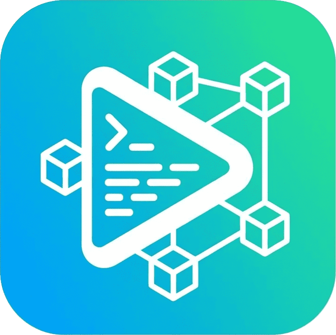

<p align="center">
  
</p>

<h1 align="center">Workspace Script Runner</h1>

<p align="center">
  <strong>Run npm scripts with intuitive UI in VS Code! 🚀</strong>
</p>

<p align="center">
  <a href="https://marketplace.visualstudio.com/items?itemName=ducdev2k1.workspace-script-runner">
    
  </a>
  <a href="https://marketplace.visualstudio.com/items?itemName=ducdev2k1.workspace-script-runner">
    
  </a>
  <a href="https://github.com/ducdev2k1/workspace-script-runner/blob/main/LICENSE">
    
  </a>
</p>

---

## ✨ Features

- 📦 **Multi-root & monorepo support** - Works with multiple projects and nested sub-projects (monorepo) simultaneously
- 🔍 **Auto-detect package manager** - npm, yarn, pnpm, bun
- ⚡ **One-click run** - Click to run any script instantly
- 🎨 **Activity Bar sidebar** - Dedicated icon in the Activity Bar for quick access
- 📋 **Running Scripts panel** - See all currently running scripts at a glance
- 🔄 **Running state indicator** - Know which scripts are currently running
- 🛑 **Easy stop/restart** - Stop or restart scripts with one click
- 🐞 **Debug Script** - Launch VS Code debugger directly from any script
- ⭐ **Favorites / Pin** - Pin frequently used scripts to the top of the list
- 📋 **Copy Command** - Right-click any script to copy the full command (e.g. `pnpm run build`)
- 🔗 **VS Code Task integration** - Scripts appear in "Tasks: Run Task" palette

## 📸 Screenshot

> TreeView showing projects with package manager icons and scripts

## 🚀 Usage

1. Open a folder/workspace with `package.json` (single project **or** monorepo)
2. Look for the **Scripts Runner** icon in the Activity Bar
3. Each project/sub-project appears as a separate section with its scripts
4. Click on any script to run it!

> **Monorepo tip:** Open the root folder (e.g. `my-app/`) — sub-projects with `package.json` are automatically detected as separate zones.

## ⚙️ Settings

```json
{
  "scriptsRunner.defaultPackageManager": "auto",
  "scriptsRunner.workspacePackageManager": {
    "project-a": "pnpm",
    "project-b": "yarn"
  }
}
```

| Setting                   | Description                          | Default |
| ------------------------- | ------------------------------------ | ------- |
| `defaultPackageManager`   | Default PM when auto-detection fails | `auto`  |
| `workspacePackageManager` | Override PM for specific projects    | `{}`    |

## 🎯 Commands

| Command                                  | Description                          |
| ---------------------------------------- | ------------------------------------ |
| `Scripts Runner: Run Script`             | Run selected script                  |
| `Scripts Runner: Stop Script`            | Stop running script                  |
| `Scripts Runner: Restart Script`         | Restart script                       |
| `Scripts Runner: Debug Script`           | Launch VS Code debugger for script   |
| `Scripts Runner: Pin to Favorites`       | Pin script to top of list            |
| `Scripts Runner: Unpin from Favorites`   | Remove script from favorites         |
| `Scripts Runner: Copy Command`           | Copy full run command to clipboard   |
| `Scripts Runner: Change Package Manager` | Override package manager for project |
| `Scripts Runner: Refresh`                | Refresh scripts list                 |

## 🛠️ Development

```bash
npm install
npm run compile
# Press F5 to launch Extension Development Host
```

## 📄 License

MIT © [ducdev2k1](https://github.com/ducdev2k1)
